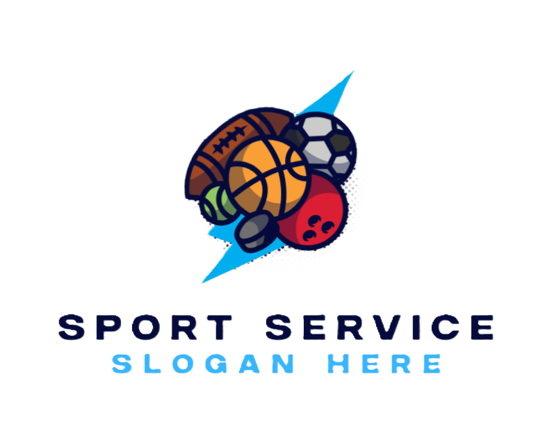
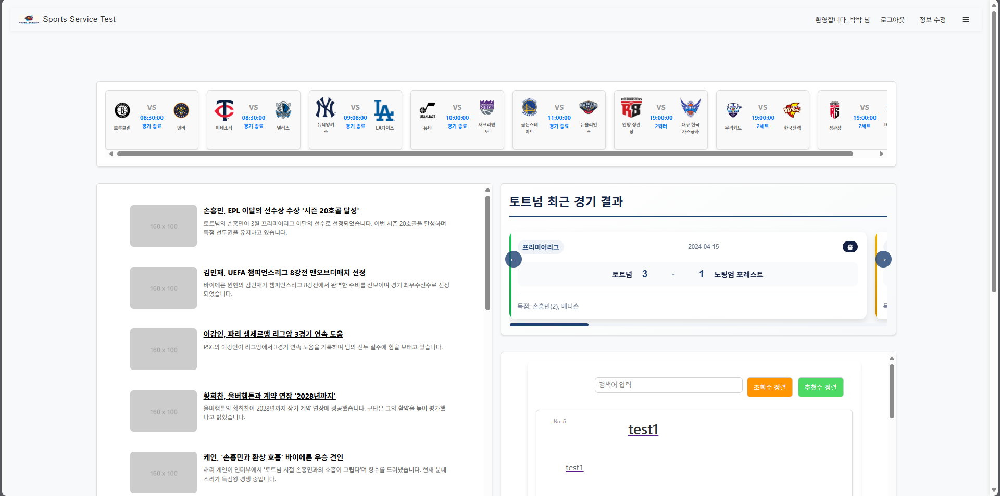
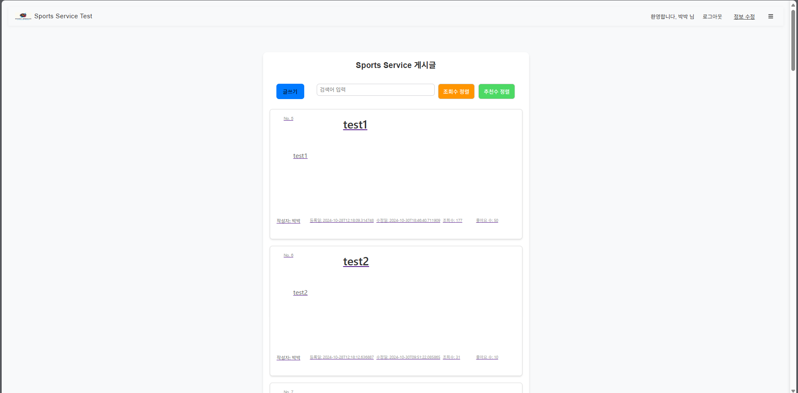
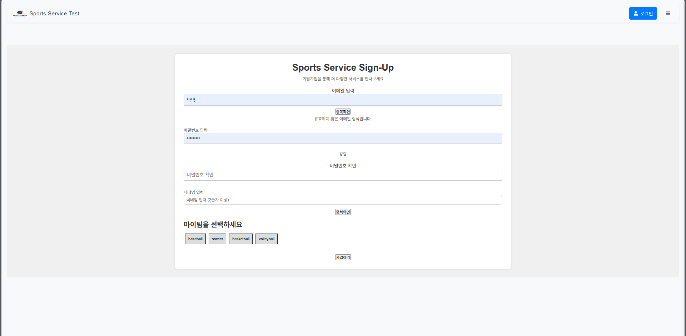

  
  
  # Sports Community Service
  스포츠 팬들을 위한 종합 커뮤니티 서비스
  
  
  

---

## 👥 팀원 소개

| 이름 | 역할 | GitHub |
|:---:|:---:|:---:|
| 시효건 | **Team Leader** 기획 / 프론트엔드 개발 |  |
| 이환희 | 프론트엔드 개발 데이터셋 구축 |  |
| 김민우 | 백엔드 개발 |  |

## 프로젝트 소개
이 프로젝트는 스포츠 팬들을 위한 종합 커뮤니티 서비스입니다. 
다양한 스포츠 리그의 팬들이 모여 소통하고, 경기 정보를 공유하며, 
자신이 응원하는 팀의 소식을 실시간으로 접할 수 있는 플랫폼입니다.

### 지원하는 스포츠 리그
- 야구: KBO, MLB
- 축구: K-League, Premier League
- 농구: KBL, NBA
- 배구: V-League (남자부/여자부)

## 주요 기능
### 1. 회원 관리
- 일반 회원가입/로그인
- 소셜 로그인 연동 (Google, Naver, Kakao)
- 프로필 관리 및 수정
- 관심 팀 설정 및 커스터마이징

### 2. 커뮤니티 기능
- 게시판 CRUD 기능
- 실시간 댓글 시스템
- 게시글 좋아요/북마크
- 키워드 검색 및 카테고리별 정렬

### 3. 팀 관련 기능
- 팀별 전용 게시판
- 경기 일정 및 결과 확인
- 팀 순위 및 통계 확인

## 기술 스택
- React
- React Router
- Axios
- Context API

## 설치 및 실행 방법
1. 저장소 클론
2. 프로젝트 빌드
3. 프로젝트 실행

## 환경 설정
프로젝트 실행을 위해 다음 환경 변수가 필요합니다:
- `REACT_APP_API_URL`: 백엔드 API 주소

## 라이선스
이 프로젝트는 MIT 라이선스를 따릅니다. 자세한 내용은 [LICENSE](LICENSE) 파일을 참고하세요.

## 스크린샷
### 메인 페이지

### 게시판

### 팀 선택 페이지

## 시스템 요구사항
- Node.js 16.0.0 이상
- npm 7.0.0 이상
- React 18.0.0 이상

## 참고
- 벡엔드 저장소: [Sports Service Backend](https://github.com/si-cpu/Sports_Service_backend)
- 더 많은 정보는 Wiki 페이지를 참고해주세요.

